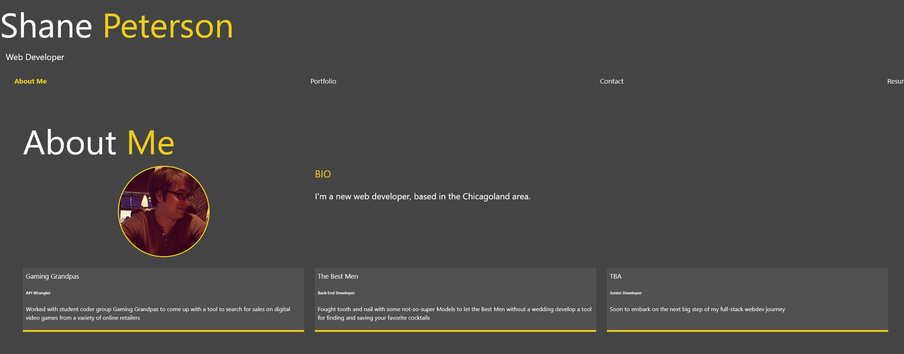

# Personal Portfolio

## Description

This is my personal portfolio, an ongoing work-in-progress (like me!) intended to demonstrate my skills and proficiencies as I continue to grow and learn as a developer.

## Technology Used

The main new technique for me showcased here is ReactJS. It also uses gh-pages to help deploy a React App to Github, and I also experimented with Sass for the first time in developing the style.

## Repo

Find the project code [here](https://github.com/shanep42/ideal-eureka)

## Screenshots

## Installation and Usage

Check out the site at its Github Pages deployment [here](https://shanep42.github.io/ideal-eureka/)

## Thanks

Thank you to Brad Traversy of [Traversy Media](https://www.youtube.com/channel/UC29ju8bIPH5as8OGnQzwJyA) - everyone who makes it 5 months in a coding Boot Camp probably has a favorite Youtube tutor, and I got most of the style here from a different project I learned there.

## Future Development
- A LOT of this is very close to looking great, and only doesn't because of deadlines - tons of room for improvement between the due date for class and the real world.
- There was some confusion with this being my first deployed React app, and I think the file structure could be easily cleaned up and made more readable and professional.
- My resume was, alas, lost in the large-scale restructuring we needed to do to make the page go live. Its lovely button remains, but I'll need to update the page (and my resume) before we're ready for prime time.